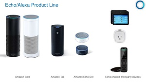

@title[Introduction]

## Voice Assistant  
### A new user experience  
Feel free to follow along: [https://bit.ly/2qxZI7s](https://gitpitch.com/copperstick6/Assistant-MADCon)
---

## What we're going to talk about today
##### (what you'll leave this room with)

@ul
- You'll understand what voice assistants are
- You'll see the what they can do and their limitations
- You'll build one!
@ulend

---

## Before we start.
##### This is for the demo. If you don't want to do the demo, ignore this stuff.
Install Node.js and functions-emulator.  
Make sure to have a Google Account. (Everyone should have one)
---

## Mac OSX installation
Install Homebrew if you don't have it
```
/usr/bin/ruby -e "$(curl -fsSL https://raw.githubusercontent.com/Homebrew/install/master/install)"
```
(You can find this on [brew.sh](https://brew.sh/) if you don't feel like typing this out.)
---
## Installing Node and Functions-emulator
```
brew install nodejs
npm -v
npm install -g @google-cloud/functions-emulator
```
@[1](This installs Node.js)
@[2](Let's check to see if installation was successful)
@[3](This installs a package called functions-emulator we'll use to deploy our stuff.)
---
## Windows Installation
Go to [nodejs.org](https://nodejs.org/en/) and install Node.js  
After installation completes, run the same commands:  
```
npm -v
npm install -g @google-cloud/functions-emulator
```
---
## Install Ngrok
Ngrok is a really cool tool that will allow your app to be deployed locally so that your Google Assistant can communicate with your code.  
Download it from [ngrok.com](https://ngrok.com/).
```
chmod ugo+x ngrok
./ngrok http 8080
```
@[1](Giving ngrok executable permissions)
@[2](Functions-emulator runs on port 8000, so ngrok will auto redirect any request to that port)
---
#### If you missed any of this, check out my slides:  [https://bit.ly/2qxZI7](https://bit.ly/2qxZI7s). All of this stuff is there.
---
### Who am I?

@ul
- CS'19
- Built 10+ Google Assistant, 5+ Alexa Apps
- Passionate about Voice Assistants
- Meme master
@ulend
---
### Why Voice Assistants?
@ul
- It's cool.
- It's flexible.
- It's easy to build interactive experiences.
@ulend
---
### History Lesson
@ul
- 1961- 2011 Crap ton of research (Voice Recognition)
- 2011 Siri (Apple) Released
- 2014 Amazon Echo Released
- May 2016 Google Assistant Released
- June 2016 Amazon Alexa Node SDK released
- December 2017 Google Assistant Node SDK released
- January 2018 Homepod (Apple) Released
@ulend
---
## Voice Assistant Products
---

### Amazon's Product offerings:
  


Main ones are Echo and Echo Show  
Personally have not messed with the Echo Show, but I'd like to
---

### Amazon Alexa  


---
### Alexa Continued
@ul
- Heavy integration with AWS services. Easy deploy w/ Lambda
- Developer Community is Poppin
- Recently released a way to make money off Alexa apps should they gain a certain level of traction
@ulend
---
### Google Assistant
  
---
### Google Assistant continued
@ul
- Lots more flexibility with mobile devices  
- You can display stuff!
- Newer Community due to recently released SDK
@ulend
---
### Apple Homepod
- Personally don't know too much about Homepod
- Uses SiriKit, so any apps you develop work on iOS phones
- Siri sucks.  

---
## Short Spiel on my view as a developer on Alexa vs Actions on Google
---
#### Now you know what these things do, let's go over how they usually work.  

---
### What the user sees
@ol
- They say something  
- It's processed  
- Something is returned  
@olend
---
#### What actually happens  

---
### Saying something (Step 1)
**Disclaimer** We don't actually know exactly how this happens. Every company does it differently. This is a guess.  
@ol
- System records what the user says  
- Speech recording is compressed and then sent off somewhere  
@olend  
@ul
- We think this happens, because if you look at the Alexa app, you are able to access recordings of your commands.  
@ulend

---
### Voice Processing (Step 2)
@ol
- TTS (Text to speech). This is already complicated.  
- Context. Try to fit what the user has said to some sort of pre-defined expected value to call the appropriate function inside some app.
@olend  

---
### Returning something (Step 3)
@ol
- Function called, and some sort of string is returned by the app called
- Function returns some sort of string that is what should be said. It can also return how it should be said/pronounced
- In Show/Assistant App, you can also force it to display something
@olend
---
# IT'S TIME TO
  
---
## No FFS. Demo time!
